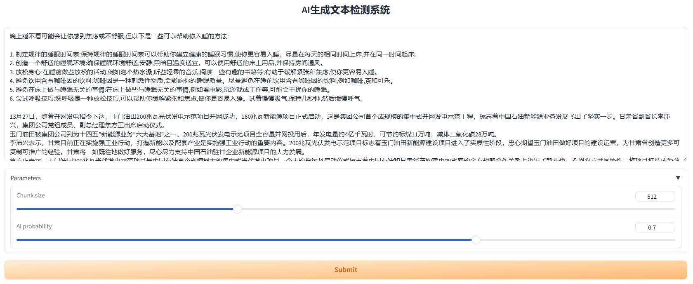
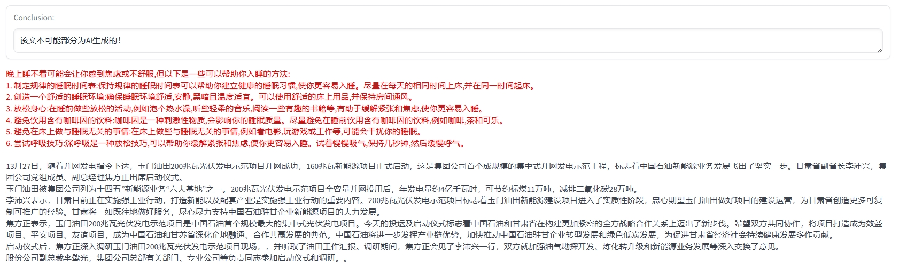

# GPTDetector: AI 生成内容检测分类器

## 技术调研

ChatGPT 是 OpenAI 2022 年 11 月推出的交互式自然语言对话模型，它能够像人类一样进行聊天交流，也让撰写邮件、论文、脚本，创作诗歌、故事等变得易如反掌。ChatGPT 发布后在业界引发了震动，甚至成功通过了谷歌的面试，收到了年薪 18 万美元的谷歌 L3 工程师的工作邀请。有学生试用 ChatGPT 来写作业和程序，并且老师很难分辨作业和程序是否为学生自己完成的。此外，学术界还出现了很多署名 ChatGPT 的待发表论文。

本章对 ChatGPT 生成内容检测工具进行了调研，包括 OpenAI 推出的 [AI文本分类器](https://openai.com/blog/new-ai-classifier-for-indicating-ai-written-text)、斯坦福大学研究团队提出的 [DetectGPT](https://github.com/eric-mitchell/detect-gpt)、普林斯顿小哥 Edward Tian 开发的 [GPTZero](https://gptzero.me/)、以及 Github 开源工具 [chatgpt-comparison-detection](https://github.com/Hello-SimpleAI/chatgpt-comparison-detection)。

### OpenAI 文本分类器

OpenAI 发布的 AI 文本分类器是一个经过微调的 GPT 模型，可以推断一段文本是否由 AI 生成，包括但不限于 ChatGPT。该模型采用的训练数据是同一主题下的人类手写和 AI 生成的文本对，用到的素材来自于维基百科数据集、2019 年收集的 WebText 数据集，以及在训练 InstructGPT 时收集的一组人类演示。为了降低检测的假阳性率（False Positive Rate），只在分类器非常自信的情况下将文本标记为可能是 AI 生成的。具体来说，分类器会将输入文本分为五类：

- 非常不可能是 AI 生成的（Very unlikely to be AI-generated）
  分类器的输出 < 0.1。在挑战集中，大约 5% 的手写文本和 2% 的 AI 生成文本有这个标注。

- 不太可能是 AI 生成的（Unlikely to be AI-generated）
  分类器的输出在 0.1 到 0.45 之间。在挑战集中，大约 15% 的手写文本和 10% 的 AI 生成文本有这个标注。

- 不清楚是否是 AI 写的（Unclear if it is AI written）
  分类器的输出在 0.45 到 0.9 之间。在挑战集中，大约 50% 的手写文本和 34% 的 AI 生成文本有这个标注。

- 可能是AI生成的（Possibly AI-generated）
  分类器的输出在 0.9 到 0.98 之间。在挑战集中，大约 21% 的手写文本和 28% 的 AI 生成文本有这个标注。

- 很可能是AI生成的（Likely AI-generated）
  分类器的输出 > 0.98。在挑战集中，大约 9% 的手写文本和 26% 的 AI 生成文本有这个标注。

OpenAI 称其分类器并不完全可靠。在英文文本测试时，分类器正确识别了 26% 人工智能生成的文本，约 9% 人类写出的内容被错误标记为人工智能生成的。
分类器对于短文本（少于 1000 个字符）的检测非常不可靠，随着输入文本长度的增加，分类器的性能有所提高。OpenAI 建议仅对英文文本使用该检测器，因为它在其他语言上的表现要差得多，并且在代码上不可靠。

- 博客介绍：[New AI classifier for indicating AI-written text](https://openai.com/blog/new-ai-classifier-for-indicating-ai-written-text)

- 开源参考：https://github.com/openai/gpt-2-output-dataset/tree/master/detector

### DetectGPT

斯坦福大学研究团队提出了一个名为 DetectGPT 的方法，它可以检测出一个段落是否是由一个给定的大型语言模型（LLM）生成的。

- 论文题目：DetectGPT: Zero-Shot Machine-Generated Text Detection using Probability Curvature.

- 论文链接：https://arxiv.org/abs/2301.11305

- 代码数据：https://github.com/eric-mitchell/detect-gpt

研究团队认为，由 LLM 生成的文本倾向于在模型的对数概率（log probability）函数的负曲率（negative curvature）区域附近徘徊。利用这一观察结果，他们定义了一个新的基于曲率的标准来判断文本是否是由给定的 LLM 生成的。他们将这种新方法称为 DetectGPT，无需训练一个单独的分类器，也无需收集真实或AI生成的文本数据集，就能完成文本检测工作。DetectGPT 比现有的零样本（zero-shot）检测方法更具鉴别性，显著提高了 20B 参数  GPT-NeoX 生成的假新闻文章的检测能力，从最强零样本基线的 0.81 AUROC 提高到 DetectGPT 的 0.95 AUROC。

为了检测一段文本是否由一个特定的 LLM（如 GPT3）生成，DetectGPT 首先使用通用的预训练模型（如 T5）生成待检测文本的轻微扰动，然后比较原文本和每个扰动文本在 LLM 下的对数概率，当平均对数比值较高时，待检测文本很可能来自于 LLM 生成。

DetectGPT 方法存在一定的局限性，首先需要我们能够评估 LLM 的对数概率，其次是可以获得一个合理的扰动函数，如果当前的扰动模型不能很好地表示有意义的改写空间，降低了曲率估计的质量，DetectGPT 的检测性能将会下降。此外，DetectGPT 相比其他检测方法需要更大的计算量。

### GPTZero

GPTZero 是普林斯顿大学计算机科学和新闻专业的学生 Edward Tian 开发的一个工具，能够有效识别 AI 生成的论文。GPTZero 的工作原理是检测文本的“困惑性”（Perplexity）和“突发性”（Burstiness）两项指标，并分别对其打分，根据统计学特征来确定文本是由人工智能生成的还是人类写的。如果这两项指标得分都很低，那么该文本很有可能出自 AI 之手。

“困惑性”指标主要是衡量文本中词句构造的复杂性和随机性。人类书写文本的遣词造句一般会比较随机，比机器容易写出出乎意料的词句。而 ChatGPT/GPT3 等语言模型接受过语料库的训练，生成的文本在一段时间内，表现出的困惑度会更均匀和恒定，选词的可预测性也更高。因此，当文本的困惑度值较低时，该文本对于 GPTZero 来说是非常熟悉的，那么它很可能是 AI 生成的；相反，如果计算得到的困惑度值越高，则越能说明文本中句子的构造或用词方式让 GPTZero 感到“惊讶”，那么它更可能是出自人类之手。

“突发性”指标主要是比较句子复杂性的变化程度，衡量它们的一致性。人类使用句子结构，会在长而复杂的句子，和短而简单的句子之间摇摆不定，有着更多的句式变化；而 AI 生成的句子则倾向于更加统一，很少会有一系列长度相差很大的句子。一段文本的“突发性”指标越低，该文本越可能是由 AI 生成的。

- GPTZero试用地址：https://gptzero.me/

- GPTZero开源参考：https://github.com/BurhanUlTayyab/GPTZero

### chatgpt-comparison-detection

chatgpt-comparison-detection 是一个 GitHub 上的项目，开发人员来自多所大学/公司的博士生和工程师。

- 项目地址：https://github.com/Hello-SimpleAI/chatgpt-comparison-detection

- 论文地址：https://arxiv.org/pdf/2301.07597.pdf

- 数据地址：https://huggingface.co/datasets/Hello-SimpleAI/HC3-Chinese

该项目提供了三个版本的检测器，且都支持中英文。检测器的模型权重在 Hugging Face 对应的链接中下载：

https://huggingface.co/Hello-SimpleAI

- QA version（问答版）：判断某个问题的回答是否由 ChatGPT 生成，使用基于 PTM（预训练语言模型）的分类器开发；

- Single-text version（独立文本版）：判断单条文本是否由 ChatGPT 生成， 使用基于 PTM（预训练语言模型）的分类器开发；

- Linguistic version（语言学版）：判断单条文本是否由 ChatGPT 生成，使用基于语言学特征的逻辑回归模型开发。

### 小结

目前，AI 生成内容的检测主要有两种思路：第一，收集同一主题下人类手写和 AI 生成的文本对数据集，基于预训练语言模型训练端到端的文本分类器；第二，从人类书写和 AI 生成文本的词句构造特点出发，计算具有区分性的关键指标（如困惑度），再使用规则或机器学习模型进行分类判断。

## GPTDetector

使用 `uer/gpt2-chinese-cluecorpussmall` 作为基座模型，基于 [Hello-SimpleAI/HC3-Chinese](https://huggingface.co/datasets/Hello-SimpleAI/HC3-Chinese) 数据集训练得到一版 AI 文本分类器 `gpt2-chinese-ai-text-classifier`。

模型下载地址：https://huggingface.co/WangZeJun/gpt2-chinese-ai-text-classifier

### Demo

- gradio==3.50.0

- easytokenizer

- transformers

安装 [easytokenizer](https://github.com/zejunwang1/easytokenizer)：

```shell
pip install git+https://github.com/zejunwang1/easytokenizer
```

启动 demo：

```shell
python gradio_demo.py --model gpt2-chinese-ai-text-classifier/ --port 9000
```





